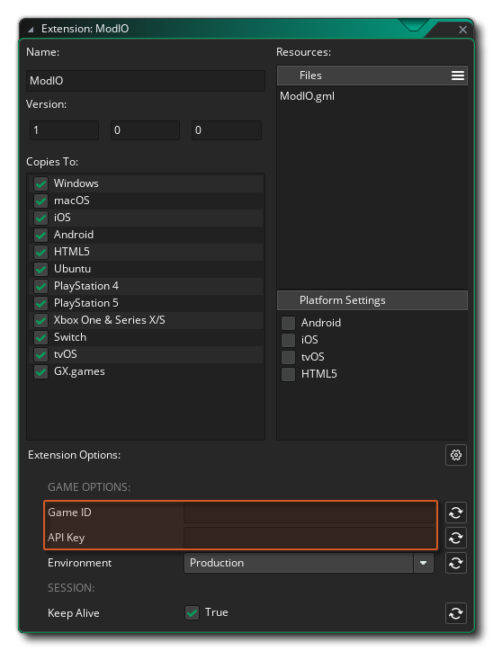

@title Quick Start Guide

# Quick Start Guide

This page contains an overview on how to get started with the mod.io extension for GameMaker.

## Overview

You should do the following things before calling any of the extension functions: 

* Add the extensions that you wish to support for authentication to your GameMaker project
* Set up the extension options for your game: add the game's ID and its API key
* Using the mod.io extension: 
  * Authenticate the user to mod.io using one of the ${module.auth} functions
  * Use the `modio_*` functions to add mods, upload modfiles to your game, retrieve info about mods, get mod stats, etc.

## Add Extensions for Authentication

Depending on the authentication method(s) you want to allow users to authenticate with, you have to add the appropriate extension to your GameMaker project.

The ${module.auth} page contains the full reference of authentication functions and more detailed information on how to get authenticated.

Currently supported are: 

* Epic Online Services
* GOG
* GoogleSignIn
* Steamworks
* E-mail
* Guest

## Extension Setup

After you've added your game to mod.io you can get its Game ID and API key under `Profile` > `Access` > `API Access`: 

Copy the game ID to the **GameID** and the API key to the **ApiKey** extension option respectively: 

[[NOTE: Most of the `modio_*` functions take the game ID as an optional parameter. If you provide it here, it will be used in all the functions.]]

Here you can also set whether to use the **Production** or the **Test** environment and whether to **Keep Alive** the session.

## Using the Extension

### Authentication

See the ${module.auth} functions for a full list and code examples on how to authenticate on each platform.

### Usage

After these steps, the extension functions can be used to communicate with mod.io using the API.